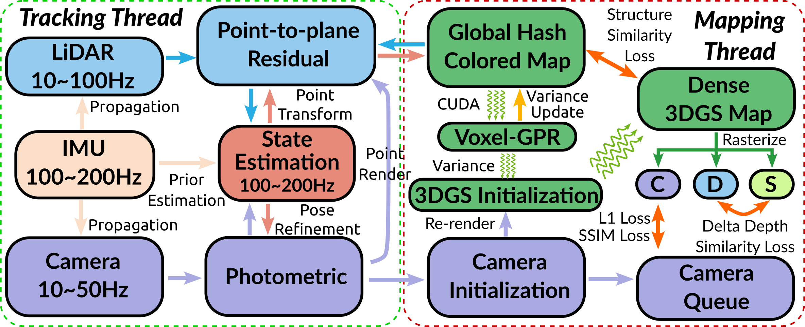

# GS-LIVOM: Real-time Gaussian Spaltting Assisted LiDAR-Inertial-Visual Odometry and Dense Mapping

## Features

A. Real-time Dense Mapping via 3D Gaussian Splatting in large-scale unbounded outdoor environments.

B. Conventional LiDAR-Inertial-Visual Odometry (LIVO) is used to estimate the pose of the sensor.

C. Self-designed Voxel Gaussian Process Regression (VGPR) is used to handle the spaisity of the LiDAR data.

D. Variance centerd Framework is developed to calculate the initialization parameters of 3D gaussians.

E. Easy-to-use. ROS-related code is provided. Any bags contains image, LiDAR points, IMU can be processed.


## 1.Overview and Contributions (2024-10-01 Update)
The system takes input from point cloud data collected by LiDAR, motion information collected by an Inertial Measurement Unit (IMU), and color and texture information captured by a camera. In the tracking thread, the ESIKF algorithm is used for tracking, achieving odometry output at the IMU frequency. In the mapping thread, the rendered color point cloud is used for Voxel-GPR, and then the data initialized 3D gaussian is input into the dense 3D gaussian map for rendering optimization. The final output is a high-quality dense 3D gaussian map. C, D, and S represent the rasterized color image, depth image, and silhouette image, respectively.

<div align="center">

</div>


## Images & Demo Video (2024-10-01 Update)

<div align="center">

</div>

<div align="center">

</div>

<div align="center">

</div>

You can find the demo video [here](https://www.youtube.com/watch?v=j9Kne47aS_0&t=76s).


## 2. Prerequisites

The equipment of this repository is as follows. And this repo contains **<u>CPP</u>**, **<u>TorchLib</u>** and **<u>ROS</u>**, so maybe it's a little difficult to install. If you are not familiar with the following steps, you can refer to [this video](https://www.youtube.com/watch?v=j9Kne47aS_0&t=76s).

2.1 Ubuntu and ROS. 

We build this repo by [RoboStack](https://robostack.github.io/). You can install different ROS distributions in **Conda Environment** via [RoboStack Installation](https://robostack.github.io/). Source code has been tested in **ROS Noetic**. Building in **conda** may be more difficult, but the ability to isolate the environment is worth doing so.

2.2 (Optional) Build Livox-SDK2 & livox_ros_driver2 in conda
``` bash
    # download
    mkdir -p ~/catkin_ws/src && cd ~/catkin_ws/src
    
    cd ~/catkin_ws/src
    git clone https://github.com/Livox-SDK/Livox-SDK2
    cd Livox-SDK2 && mkdir build && cd build

    # cmake options, -DCMAKE_INSTALL_PREFIX is path of your conda environment
    cmake -DCMAKE_INSTALL_PREFIX=/home/xieys/miniforge3/envs/{ENV_NAME}  ..

    # make && make install
    make -j60 && make install

    #clone livox_ros_driver2 and put it in your catkin_ws/src. If you don not use Livox, you can skip this step by changing -DBUILD_LIVOX=OFF in CMakeLists.txt
    cd ~/catkin_ws/src
    git clone https://github.com/Livox-SDK/livox_ros_driver2
    
    cd livox_ros_driver2

    (Important)(****NOTE, I have chaned the source code in livox_ros_driver2/CMakeLists.txt to support build. Please refer to my video in this operation.)

    ./build.sh ROS1
```

2.3 (Important) Install Torch
``` Bash
    mamba search pytorch=2.0.1

    # Please find appropriate version of torch in different channels
    mamba install pytorch=2.0.1=gpu_cuda118py39he342708_0 cudatoolkit=11.8 -c nvidia -c conda-forge
```

2.4 Some packages can be installed by:
``` Bash
    mkdir -p ~/catkin_ws/src && cd ~/catkin_ws/src

    # clone
    git clone https://github.com/xieyuser/GS-LIVOM.git
    
    # create env
    mamba create -n {ENV_NAME} python=3.9
    mamba activate {ENV_NAME}

    # install ros in conda
    mamba install ros-noetic-desktop-full -c RoboStack

    # install other packages
    cd GS-LIVOM
    mamba install --file conda_pkgs.txt
```

## 3. Build GS-LIVOM and Source
Clone the repository and catkin_make:
``` Bash
    # build
    cd ~/catkin_ws
    catkin build   # change some DEFINITIONS

    # source
    # (either) temporary
    source ~/catkin_ws/devel/setup.bash

    # (or) start with conda activate
    echo "ROS_FILE=/home/xieys/catkin_ws/devel/setup.bash
    if [ -f \"\$ROS_FILE\" ]; then
        echo \$ROS_FILE
        source \$ROS_FILE
    fi" >> ~/miniforge3/envs/{ENV_NAME}/setup.sh
```


## 4.Run on Public Datasets

Noted:

###  1). Run on [*R3Live_Dataset*](https://github.com/ziv-lin/r3live_dataset)

Before running, please type the following command to examine the image message type of ROS bag file:

```bash
rosbag info SEQUENCE_NAME.bag
```

If the image message type is **sensor_msgs/CompressedImage**, please type:

```bash
# for compressed image sensor type
roslaunch gslivom livo_r3live_compressed.launch
```

If the image message type is **sensor_msgs/Image**, please type:

```bash
# for original image sensor type
roslaunch gslivom livo_r3live.launch
```


###  2). Run on [*NTU_VIRAL*](https://ntu-aris.github.io/ntu_viral_dataset/)

```bash
roslaunch gslivom livo_ntu.launch
```

###  3). Run on [*FAST-LIVO*](https://connecthkuhk-my.sharepoint.com/:f:/g/personal/zhengcr_connect_hku_hk/Esiqlmaql0dPreuOhiHlXl4Bqu5RRRIViK1EyuR4h1_n4w?e=fZdVn0)


```bash
roslaunch gslivom livo_ntu.launch
```

###  4). Run on [*Botanic Garden Dataset*](https://github.com/robot-pesg/BotanicGarden)

Please go to the workspace of **SR-LIVO** and type:

```bash
# for Velodyne VLP-16
roslaunch gslivom livo_botanic_garden.launch

# for Livox-Avia
roslaunch gslivom livo_botanic_garden_livox.launch
```

## Acknowledgments

Thanks for [RoboStack](https://robostack.github.io/GettingStarted.html), [3D Gaussian Splatting](https://github.com/graphdeco-inria/gaussian-splatting), [Gaussian-Splatting-Cuda](https://github.com/MrNeRF/gaussian-splatting-cuda), [depth-diff-gaussian-rasterization
](https://github.com/ingra14m/depth-diff-gaussian-rasterization), [R3LIVE](https://github.com/hku-mars/r3live), [CT-ICP](https://github.com/jedeschaud/ct_icp), [Fast-LIO](https://github.com/hku-mars/FAST_LIO) and [Open-VINs](https://github.com/rpng/open_vins).


## License
The source code of this package is released under GPLv2 license. We only allow it free for academic usage. For any technical issues, please fell free to contact yxie827@connect.hkust-gz.edu.cn.